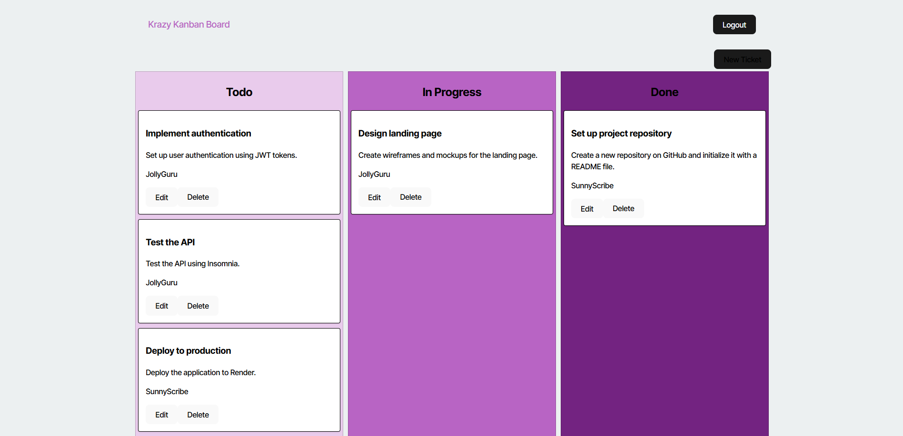

# Kanban Board

  ## Description
  This is a kanban board application utilizing JWTs. It can be used to organize tasks and sort them by completion.

  

  ## Table of Contents
  [Installation](#installation)

  [Usage](#usage)

  [Contributing](#contributing)

  [Tests](#tests)

  [Questions](#questions)

  ## Installation
  The easiest way to access the site is to go to https://kanban-board-5xkd.onrender.com and sign in using one of the users in server/src/seeds/user-seeds.ts.

  Otherwise, pull the repo and run the SQL file in the "db" directory of the server folder. Fill in DB_USER and DB_PASSWORD in the .env.EXAMPLE file before renaming it to just ".env". Back in the root folder, run "npm i && npm run build && npm run seed". To launch the site, run "npm run start".

  ## Usage
  To log in, check the the aformentioned user-seeds.ts file. Afterwards, you should be greeted with the kanban board. Tasks can be edited and deleted. To create a new task, click the dark button below "logout". You can then name and describe a task, assign it to a user, and specify its degree of completion. Users will automatically be logged out after an hour.

  ## Contributing
  Feel free to expand on this. Along with extra CSS, more code could be added to sort the tasks as well as to sign up new users.

  ## Tests
  Make sure login works, first of all. After that, try using every bit of functionality on the site to test them, including the logout.

  ## Questions
  My GitHub: https://github.com/ElBoyTM

  My email: nszalenski@gmail.com
